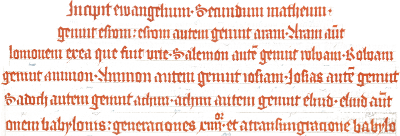
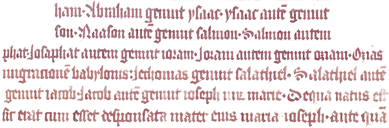
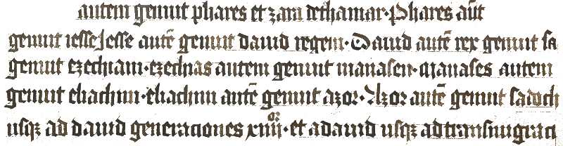

# [old ui colors](https://maybegeek.github.io/olduicolors/)

[https://maybegeek.github.io/olduicolors/](https://maybegeek.github.io/olduicolors/)

## „Mettener Armenbibel“

Folio 2r der „Mettener Armenbibel“ soll aufgrund der, dort verwendeten, lebendigen Farben als Farb-Palette zur einfachen Verwendung in CSS umgesetzt werden.

> „Mettener Armenbibel“, Biblia pauperum (1414/15). Metten. BSB-Hss Clm 8201. Folio 2r.

## Farbwahl

Die 28 Zeilen der vorliegenden Seite dienen als Vorlage. Extrahiert werden sollen die dominanten Farben bzgl. des gesamten Dokuments, wie auch diejenigen Farbcluster innerhalb der Farbgruppen.

Hierfür wurde zunächst ein manueller Ansatz gewählt, dieser aber wieder verworfen und stattdessen die automatisierte Extraktion angestrebt.

## Vorgehensweise

Die einzelnen, farbähnlichen Zeilen wurden ausgeschnitten und manuell freigestellt. Das Ergebnis sind Bilder von Farbgruppen und eine Bilddatei der freigestellten Zeilen in Kombination:

### Farbgruppen

### Farbgruppen kombiniert

### Extraktion

Mittels [color thief](https://github.com/lokesh/color-thief) wurden in einer automatischen Extraktion die Farbwerte ermittelt, darin aber noch manuell Werte ausgewählt und die Sortierung der Farbwerte in den jeweiligen Reihen augenfreundlich arrangiert.

zum Ergebnis: [https://maybegeek.github.io/olduicolors/](https://maybegeek.github.io/olduicolors/)
